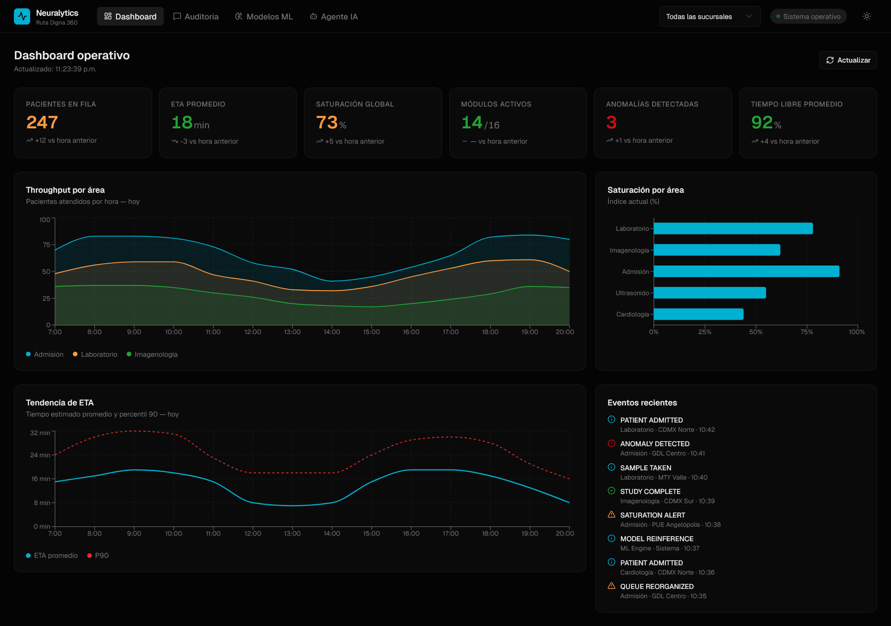
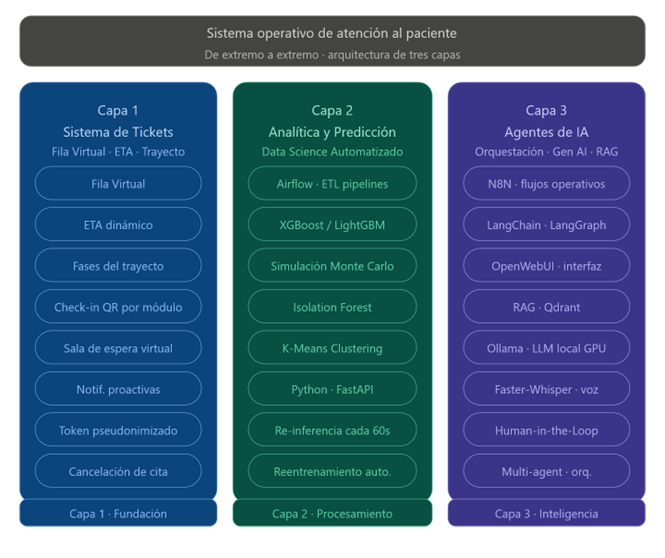

<div align="center">


</div>


---


<p align="center">
  
</p>


---


## Tabla de Contenidos

1. [Resumen del Proyecto](#1-resumen-del-proyecto)
2. [El Problema](#2-el-problema)
3. [La Solución: Arquitectura de Tres Capas](#3-la-solución-arquitectura-de-tres-capas)
4. [Arquitectura del Sistema](#4-arquitectura-del-sistema)
5. [Stack Tecnológico](#5-stack-tecnológico)
6. [Contenedores Docker](#6-contenedores-docker)
7. [Lógica de Negocio — Backend](#7-lógica-de-negocio--backend)
8. [Lógica de Negocio — Frontend](#8-lógica-de-negocio--frontend)
9. [Perfiles de Usuario e Interfaces](#9-perfiles-de-usuario-e-interfaces)
10. [Agentes de Inteligencia Artificial](#10-agentes-de-inteligencia-artificial)
11. [Algoritmos de Data Science](#11-algoritmos-de-data-science)
12. [Bus de Eventos y Flujo de Datos](#12-bus-de-eventos-y-flujo-de-datos)
13. [Flujo del Trayecto del Paciente](#13-flujo-del-trayecto-del-paciente)
14. [Cumplimiento Legal y Regulatorio](#14-cumplimiento-legal-y-regulatorio)
15. [KPIs e Impacto Proyectado](#15-kpis-e-impacto-proyectado)
16. [Infraestructura como Código](#16-infraestructura-como-código)
17. [Filosofía del Proyecto](#17-filosofía-del-proyecto)
18. [Equipo Neuralytics](#18-equipo-neuralytics)


---


## 1. Resumen del Proyecto

**CareFlow 360°** es una capa de orquestación inteligente no invasiva diseñada para transformar la experiencia del paciente en la red de clínicas de **Salud Digna** (+240 sucursales, 32 estados, 4 países) sin necesidad de reemplazar ningún sistema existente.

El sistema conecta los silos operativos independientes (Admisión, Laboratorio, Imagenología) a través de un bus de eventos en tiempo real, aplica modelos predictivos de Machine Learning para estimación de tiempos de espera (ETA), y ofrece asistencia conversacional hiperpersonalizada mediante un sistema MultiAgent RAG con LLM local en GPU.

La inspiración conceptual converge en tres paradigmas de experiencia digital que el usuario ya conoce:

| Plataforma | Aportación a CareFlow 360° |
|---|---|
| **Uber** | Fila virtual con trazabilidad end-to-end y estimación precisa de tiempos |
| **Waze** | Predicción y optimización de saturaciones y cuellos de botella |
| **Alexa** | Asistencia conversacional 24/7 hiperpersonalizada, vía voz y texto |


---


## 2. El Problema

Salud Digna parece operar bajo una arquitectura modular y distribuida — LIS (laboratorio), RIS/PACS (imagenología) y un HIS ligero para admisión — donde cada área funciona como un silo independiente. No existe un flujo de eventos compartido ni una capa de orquestación que sincronice las operaciones hacia el paciente en tiempo real.

```
MAPA DEL TRAYECTO ACTUAL

  [Paciente llega]
         │
         ▼
  [Recepción / Admisión] ──── [HIS: registro + orden de servicio]
         │
         ▼
  [Sala de espera] ◄───────── ⚠️ PUNTO CIEGO #1
         │                         Sin información de espera
         ▼
  [Llamado al área] ◄──────── ⚠️ PUNTO CIEGO #2
         │                         Sin guía del siguiente paso
         ▼
  [Toma de muestra / estudio]
         │
         ▼
  [Espera resultado] ◄─────── ⚠️ PUNTO CIEGO #3
         │                         Sin retroalimentación en tiempo real
         ▼
  [Entrega de resultado]

  [Recepción] ─── ❌ ─── [Laboratorio] ─── ❌ ─── [Imagenología]
         └──────────── ❌ ────────── [Paciente]
```

Las consecuencias operativas son saturación no anticipada, carga excesiva en recepción, incertidumbre del paciente y capacidad instalada subutilizada.


---


## 3. La Solución: Arquitectura de Tres Capas

CareFlow 360° se estructura en tres capas que se construyen una sobre la otra y pueden desplegarse incrementalmente.


<p align="center">
  
</p>


---


### Capa 1 — Sistema de Tickets y Fila Virtual

La base del sistema es la fila virtual con trazabilidad end-to-end orquestada por el personal clínico. El staff controla el inicio y fin de cada fase publicando eventos al bus Redis Streams (`PATIENT_ADMITTED → STUDY_STARTED → RESULTS_READY`). Mediante un token pseudonimizado, el paciente visualiza su turno y ETA en tiempo real vía WhatsApp o la GUI web, sin instalar ninguna aplicación.


### Capa 2 — Analítica Predictiva

El motor inteligente que transforma datos operativos en conocimiento. XGBoost estima tiempos de espera con re-inferencia cada 60 segundos y latencia inferior a 100 ms. Isolation Forest detecta anomalías y picos de demanda en tiempo real. Monte Carlo genera intervalos de confianza sobre los ETAs. K-Means segmenta patrones de demanda por sucursal y horario. Apache Airflow orquesta pipelines ETL nocturnos y el reentrenamiento automático de todos los modelos.


### Capa 3 — Agentes de IA Generativa

Sistema MultiAgent RAG sobre la base de conocimiento oficial de Salud Digna con un LLM local en GPU NVIDIA, sin APIs externas para datos clínicos. LangGraph orquesta estados conversacionales con supervisión humana activa. Faster-Whisper transcribe voz en tiempo real. Human-in-the-Loop transfiere al personal en casos complejos. Todos los flujos son predefinidos, auditables y rastreables. Cumplimiento total con LFPDPPP y NOM-024.


---


## 4. Arquitectura del Sistema

<p align="center">
  
</p>


---


## 5. Stack Tecnológico


### Hardware de Referencia (Desarrollo y Demo)

| Componente | Especificación |
|---|---|
| Sistema Operativo | Ubuntu 24.04 LTS |
| CPU | Intel Core i5-12500H (12th Gen) |
| RAM | 16 GB DDR5 |
| GPU | NVIDIA RTX 4050 (6 GB VRAM) |
| IoT (experimental) | ESP32 — Nodo WiFi CSI para estimación de ocupación |
| Orquestación | Docker Compose (IaC) |


### Frameworks y Lenguajes

| Capa | Tecnología |
|---|---|
| **Frontend** | Next.js · React · Shadcn/ui · Tailwind CSS · Plotly · TypeScript · JavaScript |
| **Backend** | Node.js · Express.js · JavaScript · Python |
| **Data Science** | Python · JupyterNotebook · Apache Airflow |
| **Agentes IA** | LangChain · LangGraph · N8N |
| **ML API** | FastAPI (Python) |
| **Inferencia LLM** | Ollama + GPU NVIDIA (Llama 3) |
| **Voz** | Faster-Whisper (Speech-to-Text, GPU) |
| **Vector DB** | Qdrant GPU |
| **RAG Pipeline** | Haystack |
| **Event Bus** | Redis Streams |
| **Auth** | JWT |


### Capas del Stack

```
┌─ Interfaces ─────────────────────────────────────────────────────┐
│  WhatsApp / Telegram · Next.js + React (Web)                     │
│  GUI Personal (Tablet) · GUI Admin (Control Tower)               │
├─ Backend Central ────────────────────────────────────────────────┤
│  Node.js + Express.js · REST API + WebSocket · FastAPI (ML API)  │
├─ Orquestación ───────────────────────────────────────────────────┤
│  N8N (automatización) · LangGraph (agentes) · Airflow (ETL)      │
│  Redis Streams (eventos)                                         │
├─ IA Generativa ──────────────────────────────────────────────────┤
│  Ollama GPU (Llama 3) · Faster-Whisper STT · LangChain · Haystack│
├─ Data Science ───────────────────────────────────────────────────┤
│  XGBoost / LightGBM · Isolation Forest · Monte Carlo · K-Means   │
├─ Bases de Datos ─────────────────────────────────────────────────┤
│  PostgreSQL (SQL) · Redis Caché + Streams · Qdrant (vectorial)   │
├─ Monitoreo ──────────────────────────────────────────────────────┤
│  Prometheus · Grafana · DCGM · cAdvisor · Node Exporter          │
└─ Seguridad & Compliance ─────────────────────────────────────────┤
   Guardrails LLM auditables · Pseudonimización tokens             │
   Human-in-the-Loop · Auditoría PostgreSQL con timestamps         │
└──────────────────────────────────────────────────────────────────┘
```


---


## 6. Contenedores Docker

El sistema se despliega mediante un único `docker-compose.yml` administrado por un script `install.sh` de IaC. Todos los servicios son open source, sin costo de licencias.

| Contenedor | Rol |
|---|---|
| `open-webui` | Interfaz conversacional para agentes de IA (Personal y Administrador) |
| `nextjs` | Aplicación web principal — Paciente, Personal y Admin |
| `node-express` | Backend central — API REST, WebSocket, Auth JWT, proxy a servicios |
| `redis` | Base de datos de caché y bus de eventos (Redis Streams) |
| `redisinsight` | GUI web de administración de Redis |
| `redis-exporter` | Exportador de métricas Redis → Prometheus |
| `postgresql` | Base de datos relacional (trayectos, registros clínicos, auditoría) |
| `pgadmin` | GUI web de administración PostgreSQL |
| `postgres-exporter` | Exportador de métricas PostgreSQL → Prometheus |
| `qdrant-gpu` | Base de datos vectorial GPU (embeddings RAG) |
| `ollama-gpu` | Servidor LLM local con GPU NVIDIA (Llama 3) |
| `faster-whisper-gpu` | Motor Speech-to-Text en GPU (transcripción de voz) |
| `n8n` | Orquestador de flujos operativos y automatizaciones WhatsApp |
| `langchain` | Framework de cadenas LLM y conectores de datos |
| `langgraph-api` | Servidor de agentes multistate con supervisión humana |
| `apache-airflow` | Orquestación de pipelines ETL y reentrenamiento de modelos ML |
| `jupyter-datascience` | Entorno Jupyter para análisis y experimentación de datos |
| `python-ml-api` | FastAPI — Motor predictivo (XGBoost, Isolation Forest, Monte Carlo) |
| `ruview` | Sistema experimental ESP32 WiFi CSI para estimación de ocupación por zona |
| `prometheus` | Recolección y almacenamiento de métricas del sistema |
| `nvidia-dcgm-exporter` | Exportador de métricas de GPU NVIDIA → Prometheus |
| `node-exporter` | Exportador de métricas del sistema host → Prometheus |
| `cadvisor` | Monitoreo de métricas por contenedor → Prometheus |
| `grafana` | Dashboards de observabilidad, alertas y KPIs operativos |


---


## 7. Lógica de Negocio — Backend


### 7.1 Bus de Eventos — Redis Streams

El corazón del sistema es el bus de eventos pub/sub implementado sobre Redis Streams. Cada área clínica publica eventos que el backend consume y orquesta.

```
EVENTOS PRINCIPALES

  PATIENT_ADMITTED      →  Admisión registra al paciente con token pseudonimizado
  STUDY_STARTED         →  Personal inicia el estudio (Lab / Imagenología)
  SAMPLE_TAKEN          →  Toma de muestra completada
  STUDY_COMPLETE        →  Estudio procesado y listo
  RESULTS_READY         →  Resultados disponibles para entrega
  QUEUE_REORGANIZED     →  El orquestador reordena la fila por saturación
  ANOMALY_DETECTED      →  Isolation Forest detecta un patrón anómalo
  SATURATION_ALERT      →  Área supera umbral de capacidad configurado
  MODEL_REINFERENCE     →  XGBoost actualiza ETAs para todos los pacientes activos
  NPS_TRIGGERED         →  N8N dispara encuesta post-visita al paciente
```

El backend Node.js es el consumidor central: recibe eventos desde Redis, actualiza el estado del trayecto en PostgreSQL, recalcula ETAs vía la Python ML API, y emite cambios de estado por WebSocket hacia las GUI en tiempo real.


### 7.2 Motor de Predicción de ETAs — XGBoost


```
PIPELINE DE PREDICCIÓN

  Entrada:
  ├── Tipo de estudio (Lab / Rayos / Eco / TAC / ...)
  ├── Hora del día y día de semana
  ├── Carga actual del área (pacientes en fila)
  ├── Tiempo promedio histórico por estudio y área
  ├── Personal disponible en turno
  └── Resultado de K-Means (segmento de demanda del momento)

  Proceso:
  ├── XGBoost → ETA puntual (p50)
  ├── Monte Carlo → Intervalo de confianza (p10–p90)
  └── Re-inferencia automática cada 60 segundos

  Salida:
  ├── ETA en minutos con intervalo de confianza
  ├── Latencia de inferencia < 100 ms
  └── Actualización vía WebSocket a todos los clientes activos
```


### 7.3 Detección de Anomalías — Isolation Forest

Isolation Forest opera en paralelo sobre el stream de métricas operativas. Detecta patrones fuera de lo ordinario (picos de demanda, demoras inusuales, personal insuficiente) y publica eventos `ANOMALY_DETECTED` al bus Redis que N8N procesa para disparar alertas al personal y al dashboard del administrador.


### 7.4 Orquestador Conversacional — N8N + LangGraph

N8N maneja flujos operativos de negocio: notificaciones WhatsApp/Telegram, escalación al personal, encuestas NPS post-visita y reasignación de pacientes. LangGraph maneja flujos conversacionales del agente de IA con gestión de estados y supervisión humana activa (Human-in-the-Loop). Ambos se comunican con el backend Node.js vía REST API interna.


### 7.5 Pipelines de ML — Apache Airflow

Airflow orquesta tres categorías de pipelines nocturnos:

- **ETL de datos clínicos:** Extracción y limpieza de registros de trayectos completados desde PostgreSQL.
- **Reentrenamiento de modelos:** XGBoost, Isolation Forest y K-Means se reentrenan con los datos del día anterior. Los datos provienen exclusivamente del personal clínico (control total del inicio y fin de cada fase), garantizando ausencia de ruido.


---


## 8. Lógica de Negocio — Frontend


### Para el Paciente

CareFlow 360° opera como una **sala de espera virtual inteligente** que permite al paciente:

- Consultar su turno en tiempo real con su posición exacta en la fila.
- Conocer el ETA con intervalo de confianza (ej. "~21 min · rango 15–30 min").
- Saber cuál es el siguiente estudio en su secuencia de atención.
- Recibir notificaciones proactivas ante cambios o llamados a su módulo.
- Activar la **sala de espera virtual** para salir de la clínica sin perder su lugar.
- Interactuar con el agente de IA para resolver dudas, siempre bajo demanda explícita.

Todo vía WhatsApp o la GUI web. Sin descarga de aplicaciones. Sin curva de aprendizaje.


### Para el Personal Clínico

El personal dispone de una vista centralizada de **Gestión Inteligente de Flujo** con cuatro métricas operativas en tiempo real:

- Pacientes en fila (conteo actual por área y sucursal).
- Saturación del área (porcentaje de capacidad operativa activa).
- ETA predicho promedio (calculado por el modelo XGBoost).
- Módulos activos (estado de disponibilidad por área).

Las acciones disponibles son: ingresar pacientes a la fila, administrar turnos, forzar recálculo de ETA, pausar pacientes atípicos, llamar turno manual, reasignar pacientes, ver agenda completa y disparar alerta N8N de emergencia. El Asistente Operativo IA está disponible en la misma vista para consultas en lenguaje natural.


### Para el Administrador

El Control Tower del administrador expone:

- **Dashboard de KPIs:** Throughput por área, saturación global, tendencia de ETA (p50 y p90), eventos recientes del bus Redis.
- **Panel de Modelos ML:** Estado de XGBoost, Isolation Forest y K-Means con versiones, última inferencia, ciclo de re-inferencia, drift score y disparador de reentrenamiento manual.
- **Panel de Auditoría:** Log completo de interacciones del agente de IA con timestamps, perfil de usuario y metadatos de supervisión.
- **Agente IA Dr360:** Interfaz conversacional multiagente conectada en tiempo real a Redis Streams y PostgreSQL para consultas operativas estratégicas.


---


## 9. Perfiles de Usuario e Interfaces


### Paciente

| Interfaz | Descripción |
|---|---|
| Formulario de ingreso a fila virtual | Registro sin app: nombre completo + folio de cita. Genera token pseudonimizado. |
| Vista de turno y ETA | Posición en fila, tiempo estimado con intervalo de confianza, seguimiento de fases del trayecto. |
| Sala de espera virtual | Permite salir de la clínica temporalmente. Recibe aviso proactivo de llamado al módulo. |
| Agente de IA (WhatsApp / OpenWebUI) | Asistente conversacional RAG con LLM local. Resuelve dudas clínicas y operativas bajo demanda. |


### Personal Clínico

| Interfaz | Descripción |
|---|---|
| Dashboard de KPIs | Indicadores de saturación, ETA promedio, pacientes en fila y módulos activos. |
| Formulario de ingreso a fila | Alta de paciente en la fila de la sucursal y área asignada por el personal. |
| Administración de la fila | Control total sobre el orden, prioridad y estado de cada paciente en su área. |
| Asistente Operativo IA (OpenWebUI) | Agente de IA para consultas operativas en lenguaje natural con contexto en tiempo real. |


### Administrador

| Interfaz | Descripción |
|---|---|
| Dashboard KPIs estratégico | Throughput, saturación global, tendencia ETA, log de eventos del bus. |
| Panel de auditoría de mensajes | Supervisión y trazabilidad completa de las interacciones con el agente IA. |
| Panel de ajuste de modelos ML | Estado, drift score, última inferencia y reentrenamiento de XGBoost, Isolation Forest y K-Means. |
| Agente IA Dr360 (OpenWebUI / WhatsApp) | Interfaz conversacional MultiAgent RAG conectada al estado operativo en tiempo real. |


---


## 10. Agentes de Inteligencia Artificial

El sistema implementa cuatro agentes especializados bajo una arquitectura MultiAgent con LangGraph, todos ejecutando un LLM local sobre GPU NVIDIA (Ollama + Llama 3) sin dependencia de APIs externas para datos clínicos.


### Paciente Bot — Agente de Acompañamiento al Paciente

Asiste al paciente durante su visita. Responde dudas sobre preparaciones de estudio, tiempos estimados, instrucciones de seguimiento y contenido educativo preventivo. Opera vía WhatsApp y la GUI web. Cada respuesta está construida sobre el corpus oficial de Salud Digna indexado en Qdrant. Transfiere al personal ante casos fuera de su alcance.


### Fila Virtual Bot — Agente de Estado del Trayecto

Agente de servicio que notifica proactivamente cambios de estado del trayecto: llamados a módulo, retrasos, reordenamientos de fila y recordatorios de preparación pre-estudio. Se activa por eventos del bus Redis Streams orquestados por N8N.


### Personal Bot — Copiloto Operativo del Staff

Asiste al personal clínico con análisis operativos en tiempo real: reporte de saturación por área, pacientes en riesgo de demora, sugerencias de reasignación y resumen del estado de los modelos ML. Accesible vía OpenWebUI con acceso a Redis Streams y PostgreSQL en tiempo real.


### Administrador Bot (Dr360) — Agente Estratégico

Agente de inteligencia operativa para administradores. Responde preguntas estratégicas sobre el sistema: comparativa de ETAs por sucursal, detección de anomalías recientes, estado global de modelos, rendimiento histórico y métricas de adopción. Arquitectura MultiAgent RAG · LangGraph v0.3 con Human-in-the-Loop activo.


### Características Comunes de Todos los Agentes

- LLM local en GPU (Ollama + Llama 3) — cero datos clínicos fuera del perímetro.
- RAG vectorial sobre Qdrant GPU con embeddings del corpus oficial de Salud Digna.
- Guardrails configurables y auditables.
- Transcripción de voz en tiempo real con Faster-Whisper.
- Supervisión humana activa (HITL) en todos los flujos conversacionales.
- Auditoría completa de mensajes con timestamps en PostgreSQL.
- Cumplimiento LFPDPPP, NOM-024-SSA3, Principios Chapultepec (SECIHTI 2026).


---


## 11. Algoritmos de Data Science


### XGBoost / LightGBM — Estimación de ETAs

Modelo de gradient boosting entrenado con el historial de tiempos por tipo de estudio, turno, hora, día de semana, carga del área y personal disponible. Produce la estimación de tiempo de espera puntual (p50). Re-inferencia cada 60 segundos con latencia de respuesta inferior a 100 ms vía FastAPI.


### Monte Carlo — Intervalos de Confianza

Simulación estocástica que genera los percentiles p10, p50 y p90 sobre el ETA base de XGBoost. Permite comunicar rangos de incertidumbre al paciente (ej. "entre 15 y 30 minutos") en lugar de un único valor puntual, incrementando la credibilidad percibida y reduciendo la frustración ante variaciones.


### Isolation Forest — Detección de Anomalías

Algoritmo de detección de outliers que opera en tiempo real sobre el stream de métricas operativas (tiempos de atención, carga por área, eventos del bus Redis). Identifica patrones fuera del comportamiento esperado y publica eventos `ANOMALY_DETECTED` que disparan alertas en el dashboard del administrador y el agente de IA del personal.


### K-Means Clustering — Segmentación de Demanda

Segmenta los patrones históricos de demanda por sucursal, horario y día de semana. Los segmentos resultantes se usan como features contextuales del modelo XGBoost, mejorando la precisión de las predicciones en escenarios de alta variabilidad operativa.


---


## 12. Bus de Eventos y Flujo de Datos


```
FLUJO DE EVENTOS EN TIEMPO REAL

  [Personal Clínico]
         │ publica evento
         ▼
  [Redis Streams — Event Bus]
         │
         ├──► [Node.js Backend]
         │         │
         │         ├──► Actualiza estado en PostgreSQL
         │         ├──► Dispara re-inferencia XGBoost (FastAPI)
         │         └──► Emite por WebSocket → GUI Paciente / Personal / Admin
         │
         ├──► [N8N Orquestador]
         │         │
         │         ├──► Notificación WhatsApp/Telegram al paciente
         │         ├──► Alerta al personal si anomalía detectada
         │         └──► Encuesta NPS post-visita al completar trayecto
         │
         └──► [LangGraph — Agentes IA]
                   │
                   ├──► Contexto actualizado para respuestas del agente
                   └──► Escalación HITL al personal si necesario
```


---


## 13. Flujo del Trayecto del Paciente

```
TRAYECTO COMPLETO CON CAREFLOW 360°

  FASE 1 — ADMISIÓN
  ══════════════════════════════════════════════════════════════════
  El personal registra al paciente en el sistema.
  Redis Streams recibe: PATIENT_ADMITTED
  El paciente recibe su token pseudonimizado por WhatsApp o QR.
  XGBoost calcula el ETA inicial. La GUI muestra turno y fila.

  FASE 2 — SALA DE ESPERA VIRTUAL
  ══════════════════════════════════════════════════════════════════
  El paciente activa la sala de espera virtual.
  Puede salir de la clínica sin perder su lugar.
  Recibe aviso proactivo cuando debe acercarse al módulo.
  El agente de IA está disponible bajo demanda para dudas.

  FASE 3 — ESTUDIO Y PROCESAMIENTO
  ══════════════════════════════════════════════════════════════════
  El personal publica: STUDY_STARTED → SAMPLE_TAKEN → STUDY_COMPLETE
  XGBoost actualiza ETA cada 60s con la nueva carga del área.
  Isolation Forest monitorea anomalías de forma continua.
  La GUI del paciente refleja el avance de su trayecto en tiempo real.

  FASE 4 — ENTREGA Y CICLO DE MEJORA CONTINUA
  ══════════════════════════════════════════════════════════════════
  El personal publica: RESULTS_READY
  El paciente recibe confirmación y tiempo estimado de resultados digitales.
  N8N dispara la encuesta NPS post-visita automáticamente.
  Apache Airflow ingesta los datos del trayecto completado.
  XGBoost e Isolation Forest se reentrenan con datos limpios y verificados.
  El sistema aprende de cada visita y mejora sus predicciones.
```


---


## 14. Cumplimiento Legal y Regulatorio

CareFlow 360° está diseñado con cumplimiento normativo desde la arquitectura, no como capa posterior.

| Marco Regulatorio | Aplicación en el Sistema |
|---|---|
| **LFPDPPP** | Pseudonimización de tokens del paciente. LLM local sin APIs externas. Auditoría completa de datos. |
| **Ley General de Salud** (Art. 71 Bis/Ter/Quáter — Enero 2026) | Marco de referencia para el manejo de datos de salud en el sistema. |
| **NOM-004-SSA3** | Expediente clínico — el sistema no almacena resultados de estudios, solo estado del trayecto. |
| **NOM-024-SSA3** | Sistemas de información en salud — interoperabilidad y seguridad de registros. |
| **NOM-035-SSA3** | Referencia para flujos de información clínica operativa. |
| **Principios Chapultepec — SECIHTI** (Enero 2026) | Marco de gobernanza de IA aplicado al diseño de agentes y guardrails del sistema. |
| **White House National AI Policy Framework** (Marzo 2026) | Marco internacional de referencia para el diseño ético y seguro de sistemas de IA en salud. |
| **JCI · CAP · ISO 15189** | Certificaciones vigentes de Salud Digna consideradas como contexto de calidad y trazabilidad. |


### Mecanismos de Seguridad Implementados

- Token pseudonimizado por visita: el paciente nunca expone datos clínicos en las interfaces públicas.
- LLM local en GPU sin APIs externas: los datos clínicos no salen del perímetro.
- Guardrails configurables en todos los agentes de IA.
- Human-in-the-Loop activo en cada flujo conversacional.
- Auditoría completa en PostgreSQL con timestamps inmutables por evento.
- Agente experimental de prediagnóstico (AgentBot Doctor) con caveat explícito: clasificación COFEPRIS pendiente de evaluación, fuera del scope del MVP.


---


## 15. KPIs e Impacto Proyectado

Con más de 240 clínicas en red, 32 estados y presencia en 4 países, cualquier mejora porcentual en estos indicadores representa millones de interacciones anuales transformadas.

| KPI | Objetivo | Referencia |
|---|---|---|
| Reducción de espera percibida | −30% | Meta del primer trimestre en clínica piloto |
| Adopción sin instalar app | >60% | Vía WhatsApp y GUI web en el primer mes |
| Tasa de escalación al personal | <15% | El agente RAG resuelve el 85%+ de forma autónoma |
| Net Promoter Score | +40 NPS | Capturado por encuesta automática N8N post-visita |
| Latencia de re-inferencia XGBoost | <100 ms | Por cada ciclo de 60 segundos |
| Satisfacción del paciente | +30% | Proyección basada en reducción de incertidumbre |


---


## 16. Infraestructura como Código

El sistema completo se levanta con un único comando mediante el script `install.sh`:

```bash
# Clonar el repositorio
git clone https://github.com/neuralytics/careflow-360.git
cd careflow-360

# Configurar variables de entorno
cp .env.example .env
# Editar .env con parámetros de la sucursal

# Levantar el stack completo
bash install.sh

# O directamente con Docker Compose
docker compose up -d
```

El `docker-compose.yml` está parametrizado por sucursal, lo que permite despliegue reproducible en cualquier servidor con Ubuntu 24.04 y Docker, en entornos on-premise, cloud o híbridos, sin configuración manual adicional.

### Estructura del Repositorio

```
careflow-360/
├── docker-compose.yml          # Stack completo (~24 servicios)
├── install.sh                  # Script IaC de despliegue
├── .env.example                # Variables de entorno por sucursal
├── prometheus.yml              # Configuración de scraping de métricas
│
├── frontend/                   # Next.js + React + Shadcn/ui
│   ├── app/paciente/           # GUI Paciente (fila virtual, turno, ETA)
│   ├── app/personal/           # GUI Personal (dashboard, fila, IA)
│   └── app/admin/              # GUI Administrador (KPIs, ML, auditoría)
│
├── backend/                    # Node.js + Express.js
│   ├── api/                    # REST API endpoints
│   ├── websocket/              # Servidor WebSocket en tiempo real
│   └── redis/                  # Consumidores de Redis Streams
│
├── ml-api/                     # Python FastAPI
│   ├── xgboost/                # Motor de predicción ETA
│   ├── isolation_forest/       # Detección de anomalías
│   └── monte_carlo/            # Intervalos de confianza
│
├── airflow/                    # Apache Airflow DAGs
│   ├── etl/                    # Pipelines de extracción y limpieza
│   └── retraining/             # Reentrenamiento automático de modelos
│
├── agents/                     # LangGraph + LangChain
│   ├── paciente_bot/           # Agente de acompañamiento al paciente
│   ├── fila_bot/               # Agente de estado del trayecto
│   ├── personal_bot/           # Copiloto operativo del staff
│   └── admin_bot/              # Agente estratégico Dr360
│
├── n8n/                        # Flujos N8N exportados
│   ├── whatsapp_notif.json     # Notificaciones WhatsApp/Telegram
│   ├── nps_survey.json         # Encuesta post-visita
│   └── emergency_alert.json    # Alertas de emergencia al staff
│
└── notebooks/                  # Jupyter — Análisis y experimentación
    ├── eda_tiempos.ipynb        # Análisis exploratorio de tiempos
    └── model_validation.ipynb  # Validación de modelos ML
```


---


## 17. Filosofía del Proyecto

La filosofía de CareFlow 360° se sustenta en cuatro pilares que se sostienen mutuamente:

**Pilar I — Soberanía:** Soberanía de datos, cumplimiento legal y ético, y seguridad de la información. Toda la gestión de datos clínicos respeta la privacidad, las normativas vigentes y los estándares de protección nacionales e internacionales. LLM local, sin APIs externas, sin licencias de terceros.

**Pilar II — Ingeniería:** Enfoque DevOps y MLOps apoyado en arquitecturas de microservicios, Infraestructura como Código y tecnologías Open Source. Despliegues reproducibles, escalabilidad horizontal y mantenimiento eficiente. SCRUM con sprints de 48 horas durante el hackathon.

**Pilar III — Inteligencia:** Arquitecturas orientadas a eventos combinadas con IA y analítica predictiva. Orquestación dinámica del sistema y toma de decisiones en tiempo real. Detección de anomalías proactiva. RAG auditable. Multi-agent con supervisión humana.

**Pilar IV — Interfaces:** Interfaces gráficas intuitivas y accesibles para todo tipo de usuarios, desde pacientes hasta personal operativo. Sin curva de aprendizaje. Sin instalación de apps. Acciones de un solo toque para el staff. Contenido educativo entregado bajo demanda.


---


## 18. Equipo Neuralytics

Equipo multidisciplinario de Ingenieros en Software con especialidades complementarias, formado para abordar de manera integral el desafío del track: desde interfaces gráficas intuitivas y accesibles hasta modelos predictivos robustos y despliegue reproducible mediante microservicios e infraestructura como código.


---


<p align="center">
  <sub>Mariana Elizabeth Reyes Rocha - Daniel Humberto Reyes Rocha - Alan de Jesus Nieto Cardenas - Alan Manuel Medina Solis</sub>
</p>


---


<p align="center">
  <strong>Talent Hackathon 2026 · Genius Arena · Salud Digna · Atención 360° en Tiempo Real</strong>
</p>


---
