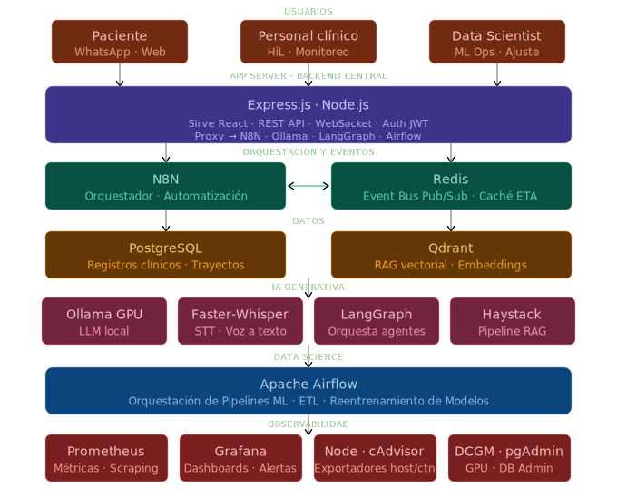

# 🥇 Neuralytics


---


### *El sistema operativo de atención al paciente*

> **(Uber + Waze + Alexa) para Clínicas — Talent Hackathon 2026 · Track Salud Digna · Atención 360° en Tiempo Real**


---


## Índice

1. [El Problema](#el-problema)
2. [La Solución](#la-solución)
3. [Analogías Clave](#analogías-clave)
4. [Arquitectura del Sistema](#arquitectura-del-sistema)
5. [Stack Tecnológico](#stack-tecnológico)
6. [Lógica de Negocio en el Backend](#lógica-de-negocio-en-el-backend)
7. [APIs del Sistema](#apis-del-sistema)
8. [Perfiles de Usuario](#perfiles-de-usuario)
9. [Tracking del Paciente en Clínica](#tracking-del-paciente-en-clínica)
10. [Aprovechamiento de Tiempos Muertos](#aprovechamiento-de-tiempos-muertos)
11. [Data Science & Modelos ML](#data-science--modelos-ml)
12. [IA Conversacional — El Asistente](#ia-conversacional--el-asistente)
13. [Observabilidad y Monitoreo](#observabilidad-y-monitoreo)
14. [Seguridad y Soberanía de Datos](#seguridad-y-soberanía-de-datos)
15. [Infraestructura y Despliegue](#infraestructura-y-despliegue)
16. [KPIs y Métricas de Éxito](#kpis-y-métricas-de-éxito)
17. [Roadmap del Hackathon](#roadmap-del-hackathon)


---


## El Problema

Actualmente, la experiencia del paciente en las clínicas de Salud Digna está **fragmentada y llena de puntos ciegos**. La falta de comunicación en tiempo real entre áreas genera:

- ⏳ Tiempos de espera improductivos e inciertos
- 📢 Carga operativa excesiva en recepción por preguntas repetitivas
- 😤 Sensación de incertidumbre e incomunicación en el paciente
- 🔇 Sistemas reactivos y aislados: LIS, RIS y Admisión no se hablan en tiempo real
- ❌ Tiempos muertos que no generan ningún valor para el paciente ni para la clínica

Los sistemas actuales no permiten:
- Gestión inteligente de capacidad instalada
- Predicción de saturación de servicios
- Guía proactiva al paciente sobre su siguiente paso
- Transformar la espera en una experiencia de salud proactiva


---


## La Solución

**Ruta Digna 360** es el sistema operativo de atención al paciente de extremo a extremo (end-to-end). No es solo un chatbot ni solo un modelo de ML — es una capa de orquestación inteligente que conecta cada área de la clínica y acompaña al paciente durante toda su visita, igual que Uber acompaña cada viaje.

Ruta Digna 360 no reemplaza ningún sistema existente. Se integra como capa de orquestación sobre infraestructura que Salud Digna ya opera: el LIS automatizado al 100% en microbiología, las órdenes médicas digitales, el canal WhatsApp Business ya activo para comunicación con médicos, y los tableros de analítica existentes. La integración es no invasiva, expone endpoints que los sistemas actuales pueden llamar mediante webhook sin modificar su arquitectura interna. partimos de una infraestructura seria y la convertimos en un copiloto clínico real


### Objetivos finales

| Eje | Objetivo |
|---|---|
| 🧑‍⚕️ Paciente | Informado, sin incertidumbre, con control de su tiempo |
| 👩‍💼 Personal | Asistido por IA, con sugerencias operativas en tiempo real |
| 🏥 Clínica | Optimizada, con capacidad instalada gestionada inteligentemente |


---


## Analogías Clave


---


### 🚗 UBER — Conexión y Trazabilidad de Extremo a Extremo

Cuando el paciente llega a cualquier clínica de Salud Digna para un estudio o consulta, se le asigna un **token de trayecto** y el viaje comienza. A través de WhatsApp, el sistema orquesta PostgreSQL y Redis para mantener un estado en tiempo real. El paciente sabe exactamente en qué fase está:

```
"En espera para Toma de Muestra"  →  "Estudio en progreso"  →  "Resultados listos"
```

Para el administrador: visibilidad total de la capacidad instalada frente a la demanda actual.


---


### 🗺️ WAZE — Navegación Inteligente y Optimización Predictiva

El modelo de Data Science (XGBoost + Isolation Forest) lee el flujo de pacientes actualizando estados. Si detecta que el área de Ultrasonido tiene un pico de demanda inusual, el sistema **recalcula los ETAs automáticamente** y notifica al paciente de inmediato. En el backend, sugiere a los coordinadores redistribuir al personal disponible al Recalcular rutas, Evita saturación, Optimiza tiempos.


---


### 🤖 ALEXA — Asistencia Conversacional con Guardrails

Chatbot accesible por **WhatsApp, Telegram y GUI Web** — los canales que el paciente ya usa, sin instalar nada. Responde dudas operativas:

- *"¿Necesito ir en ayunas?"*
- *"¿Cuánto falta para mi turno?"*
- *"¿Dónde está el área de mastografía?"*

Apoyado en arquitectura **RAG estricta** (Qdrant + Ollama GPU). Regla de oro: **cero alucinaciones**. Si detecta una consulta clínica compleja o un paciente molesto, el flujo **Human-in-the-Loop** transfiere la conversación al personal silenciosamente. Todo flujo es predefinido y auditable.


---


## Arquitectura del Sistema




---


### Arquitecturas del Proyecto

| Capa | Arquitectura |
|---|---|
| **Host** | Self-Hosted / On-Premise |
| **Software** | Microservicios (Docker Compose) |
| **Monitoreo** | Pull-Based + Pushgateway (Prometheus) |
| **Agentes IA** | Human in the Loop |
| **Redes** | Red interna (tráfico privado) + Red externa (servicios públicos) |
| **Bases de datos** | SQL (registros) · NoSQL/caché (Redis) · Vectorial (RAG) · Graph (Agentes) |


---


## Stack Tecnológico


---


### Contenedores del Sistema (22 servicios)


#### 🧠 Capa de Inteligencia Artificial

| Contenedor | Imagen | Función |
|---|---|---|
| `ollama` | `ollama/ollama:latest` (GPU) | Servidor LLM local — Llama 3, Mistral, Phi-3 |
| `open-webui` | `ghcr.io/open-webui/open-webui` | Interfaz admin para gestión de modelos y prompts |
| `faster-whisper` | `onerahmet/openai-whisper-asr-webservice` (GPU) | STT — transcripción de notas de voz WhatsApp |
| `langgraph-api` | `langchain/langgraph-api` | Flujos conversacionales stateful + Human-in-the-Loop |
| `langchain` | `langchain/langchain` | Imagen base para Python ML API (FROM en Dockerfile) |
| `python-ml-api` | `build: ./ml_api` (FROM langchain/langchain) | FastAPI que sirve XGBoost en runtime — endpoint `/predict/eta` |


#### 🗄️ Capa de Datos

| Contenedor | Imagen | Función |
|---|---|---|
| `postgres` | `postgres:16` | Base de datos principal — trayectos, históricos, auditoría |
| `pgadmin` | `dpage/pgadmin4` | UI de administración PostgreSQL |
| `redis` | `redis:7-alpine` | Cache · Redis Streams (bus de eventos) · estado de sesión |
| `redis-insight` | `redis/redisinsight` | UI de inspección de Redis Streams en tiempo real |
| `qdrant` | `qdrant/qdrant` (GPU) | Base de datos vectorial para RAG del chatbot |


#### ⚙️ Capa de Orquestación y Pipelines

| Contenedor | Imagen | Función |
|---|---|---|
| `n8n` | `n8nio/n8n` | Orquestador de flujos de negocio — notificaciones, escalado, reasignación |
| `airflow` | `apache/airflow:2.9` | Pipelines batch — reentrenamiento ML, ETL histórico, reportes |
| `jupyter` | `jupyter/datascience-notebook` | Entrenamiento interactivo de modelos XGBoost, exploración de datos |


#### 🌐 Capa de Aplicación

| Contenedor | Imagen | Función |
|---|---|---|
| `backend` | `build: ./backend` (Node.js + Next.js) | API REST · WebSocket Server · GraphQL · Lógica de negocio |


#### 📊 Capa de Observabilidad

| Contenedor | Imagen | Función |
|---|---|---|
| `prometheus` | `prom/prometheus` | Recolección y almacenamiento de métricas |
| `grafana` | `grafana/grafana` | Dashboards operativos en tiempo real |
| `cadvisor` | `gcr.io/cadvisor/cadvisor` | Métricas de cada contenedor Docker |
| `node-exporter` | `prom/node-exporter` | Métricas del sistema operativo host |
| `redis-exporter` | `oliver006/redis_exporter` | Métricas de Redis hacia Prometheus |
| `postgres-exporter` | `prometheuscommunity/postgres-exporter` | Métricas de PostgreSQL hacia Prometheus |
| `dcgm-exporter` | `nvcr.io/nvidia/k8s/dcgm-exporter` | Métricas GPU NVIDIA (VRAM, utilización, temperatura) |


### Frameworks y Lenguajes

```
Frontend:    React + TypeScript + JavaScript +  Shadcn/ui + Tailwind CSS + Plotly
Backend:     Node.js + Next.js + Express.js + TypeScript + Python
Data:        Python (pandas, scikit-learn, XGBoost, LightGBM)
IaC:         Docker Compose + Shell Script (.sh)
```


### Compatibilidad con Proveedores LLM Cloud

El sistema es compatible con proveedores cloud como alternativa o complemento al LLM local:

| Proveedor | Modelos compatibles |
|---|---|
| **Anthropic** | Claude 3.5 Sonnet, Claude 3 Opus |
| **OpenAI** | GPT-4o, GPT-4, GPT-3.5-Turbo |
| **Google** | Gemini Pro, Gemini Flash |
| **AWS / Azure** | Bedrock, Azure OpenAI |
| **OpenRouter** | API unificada multi-modelo |

> La elección entre local (Ollama) y cloud depende de la naturaleza del dato a procesar. Datos clínicos sensibles → local. Contenido educativo genérico → cloud opcional.


---


## Lógica de Negocio en el Backend


---


### 1. Bus de Eventos en Tiempo Real

**Tecnología:** Redis Streams + Node.js Consumer Groups

Cada área de la clínica publica eventos al stream. El backend Node.js actúa como consumidor orquestador:

```
PATIENT_ADMITTED      → inicia trayecto, asigna token pseudonimizado
CHECKIN_QR            → paciente escaneó QR en módulo físico
STUDY_STARTED         → técnico inició el estudio (tablet)
SAMPLE_TAKEN          → muestra tomada en laboratorio
STUDY_COMPLETE        → estudio finalizado en módulo
RESULTS_READY         → resultados disponibles en portal
SATURATION_DETECTED   → Isolation Forest detectó pico inusual
ETA_RECALCULATED      → XGBoost recalculó tiempo estimado
```


### 2. Motor de Predicción de ETAs

**Tecnología:** XGBoost / LightGBM · Python ML API (FastAPI) · Jupyter

- Modelo entrenado con histórico de tiempos reales por tipo de estudio, turno y día
- Re-inferencia cada 60 segundos vía llamada REST al endpoint `/predict/eta/:stationId`
- Latencia de respuesta: < 100ms
- Features principales: hora del día, día de la semana, carga actual del módulo, tipo de estudio, número de pacientes en cola

**Flujo del modelo:**
```
Jupyter → entrena modelo → exporta model.pkl
       → volumen compartido Docker
       → Python ML API (FastAPI) → carga en startup
       → responde /predict/eta en runtime
```


### 3. Orquestador de Trayecto

**Tecnología:** N8N (flujos de negocio) + LangGraph API (flujos conversacionales)

- **N8N** gestiona: notificaciones WhatsApp, escalado a personal humano, reasignación de técnicos, encuestas post-visita
- **LangGraph** gestiona: estado de la conversación del chatbot, contexto multi-turno, transiciones Human-in-the-Loop


### 4. Interfaz de Tracking — Visibilidad del Paciente

**Tecnología:** React + WebSocket + WhatsApp

- WebSocket pushea el estado del trayecto al frontend en tiempo real sin polling
- WhatsApp envía notificaciones push sin necesidad de app instalada
- El paciente ve su trayecto actualizado automáticamente en cualquier dispositivo


---


## APIs del Sistema

El sistema expone tres tipos de API según el caso de uso:


---


### REST — Request/Response y CRUD

Endpoints principales del Core:

```
POST  /auth/login                    Autenticación por folio+PIN o credenciales staff
POST  /journey/checkin               Registro de llegada — genera token de trayecto
GET   /journey/:token/status         Estado actual del trayecto del paciente
POST  /journey/scan                  Check-in por QR en módulo físico
PUT   /station/:id/state             Actualizar estado del módulo (tablet del técnico)
POST  /station/:id/transition        Transición STUDY_STARTED / STUDY_COMPLETE
GET   /predict/eta/:stationId        ETA predicho por XGBoost para un módulo
POST  /chat/message                  Enviar mensaje al chatbot RAG
POST  /journey/virtual-room          Activar sala de espera virtual
GET   /clinic/:id/capacity           Snapshot de capacidad instalada vs demanda
PUT   /staff/assign                  Reasignar técnico a módulo (sugerido por IA)
```


### WebSocket — Tiempo Real (push del servidor)

```
ws/patient/:token           JOURNEY_UPDATE · ETA_RECALCULATED · NEXT_STEP · ALERT
ws/staff/:clinicId/:stId    PATIENT_INCOMING · QUEUE_UPDATE · REASSIGN_SUGGESTED
ws/admin/:clinicId          SATURATION_ALERT · ANOMALY_DETECTED · STAFF_SUGGESTION
ws/virtual-room/:clinicId   QUEUE_POSITION_UPDATE · CALL_TO_RETURN · TURN_IMMINENT
```


### GraphQL — Consultas Complejas (dashboard admin)

```graphql
query clinicStats($from: Date, $to: Date)      # Métricas históricas filtradas
query patientJourney($token: String)            # Trayecto completo de un paciente
query staffPerformance($period: String)         # Rendimiento del personal
mutation resolveAlert($alertId: ID)             # Marcar alerta como atendida
mutation updateStationCapacity($id: ID)         # Ajustar capacidad de módulo
```


> **Criterio de uso:** REST para acciones, WebSocket para tiempo real, GraphQL para reportes históricos complejos con múltiples filtros.


---


## Perfiles de Usuario


---


### 🧑‍⚕️ Paciente

- Recibe folio y token de trayecto al llegar
- Visualiza su posición en cola y ETA por WhatsApp o GUI Web
- Activa sala de espera virtual para salir de la clínica sin perder su turno
- Recibe notificaciones automáticas de cambios, alertas y siguiente paso
- Interactúa con el chatbot RAG para resolver dudas operativas
- Hace check-in por QR al llegar a cada módulo


### 👩‍💼 Personal / Técnico

- Actualiza el estado del módulo desde tablet (IDLE · BUSY · OVERLOADED)
- Marca inicio y fin de cada estudio con un toque
- Ve la cola de pacientes asignados con ETAs en tiempo real
- Recibe sugerencias de reasignación del sistema
- Puede intervenir en conversaciones del chatbot (Human-in-the-Loop)


### 👨‍💼 Administrador

- Dashboard global de capacidad instalada vs demanda en tiempo real
- Recibe alertas de saturación detectadas por Isolation Forest
- Acepta o rechaza sugerencias de redistribución de personal
- Accede a reportes históricos vía GraphQL
- Monitorea precisión del modelo ML y métricas de GPU / sistema


---


## Tracking Físico del Paciente en Clínica

El tracking físico dentro de la clínica se resuelve mediante dos mecanismos complementarios:


---


### 1. Staff State Machine (mecanismo primario)

El técnico de cada módulo actualiza el estado del paciente desde su tablet con un solo toque:

```
[Iniciar estudio]  →  evento STUDY_STARTED  →  Redis Streams  →  WebSocket  →  Paciente notificado
[Completar]        →  evento STUDY_COMPLETE →  Redis Streams  →  N8N orquesta siguiente paso
```

Este es el patrón estándar de los sistemas HL7 en entornos clínicos reales. Es simple, confiable y auditable.


### 2. QR Check-in por Módulo (mecanismo complementario)

Cada área de la clínica tiene un código QR impreso. El paciente lo escanea al llegar al módulo:

```
Paciente llega a Ultrasonido → escanea QR
→ POST /journey/scan {stationId, token}
→ evento CHECKIN_QR en Redis Streams
→ WhatsApp: "Llegaste a Ultrasonido. Tiempo estimado: 20 min. Te avisamos cuando sea tu turno."
```

**Ventajas:** cero hardware adicional, cero fricción para el paciente, trazabilidad completa de presencia física.


### 3. RuView WiFi Sensing — Estimación Anónima de Volumen por Área (mecanismo de inteligencia operativa)

Mientras los mecanismos 1 y 2 resuelven el trayecto individual del paciente, existe una brecha paralela en el lado operativo: el personal de clínica no tiene visibilidad en tiempo real de cuántas personas están acumuladas en cada área. RuView cubre exactamente esa capa mediante sensado pasivo de señal WiFi, sin cámaras, sin identificación y sin fricción alguna para el paciente.

¿Qué es RuView y qué hace en este contexto?
RuView es un sistema de percepción de IA en el edge que analiza las perturbaciones de la señal WiFi causadas por la presencia y movimiento humano — reconstruyendo conteo de personas, presencia y movimiento en tiempo real, completamente sin cámaras ni wearables. Para el caso de Salud Digna se usa exclusivamente para el conteo de ocupación por zona, alertas personalizadas indicativas, no clínicas. Los datos de RuView no entran al expediente clínico. Son datos operativos de flujo, no datos diagnósticos. Esa distinción los hace tratables bajo consentimiento LFPDPPP estándar, no bajo NOM-004 completa.


---


## Aprovechamiento de Tiempos Muertos


---


### Sala de Espera Virtual

El paciente no necesita permanecer físicamente en la clínica durante su espera. Al activar la sala virtual:

- El sistema guarda su posición en la cola
- El paciente puede ir a la farmacia, comer, o quedarse en casa
- Recibe notificación cuando su turno está próximo: *"Regresa en 10 minutos, eres el siguiente en Laboratorio"*
- La clínica reduce la densidad de personas en sala de espera física


### Contenido Proactivo Durante la Espera

Mientras el paciente espera (físicamente o en sala virtual), el sistema puede enviarle por WhatsApp:

- Recordatorio de preparación específica para su estudio (*"Recuerda: ayuno de 8 horas para tu biometría"*)
- Video de 90 segundos explicando su próximo estudio
- Encuesta de satisfacción preventiva
- Consejos educativos de salud preventiva relevantes a su perfil


### Mapa Interactivo del Trayecto

La interfaz del paciente puede mostrar un mapa visual de su trayecto (estilo Uber) con:

- Progreso actual en la secuencia de estudios
- ETA actualizado por módulo
- Instrucciones de preparación para el siguiente estudio
- Alertas en tiempo real ante retrasos o cambios


---


## Data Science & Modelos ML


---


### Algoritmos Implementados

| Algoritmo | Aplicación en el sistema |
|---|---|
| **XGBoost / LightGBM** | Predicción de ETAs por módulo, tipo de estudio, turno y día |
| **Isolation Forest** | Detección de anomalías — picos de demanda inusuales, tiempos outliers |
| **K-Means Clustering** | Segmentación de pacientes por patrones de uso y horas pico |
| **Simulación Monte Carlo** | Estimación de rangos de incertidumbre en ETAs (intervalos de confianza) |


### Pipeline de Datos

```
Airflow (noche)
  → ETL de trayectos históricos desde PostgreSQL
  → Limpieza y feature engineering en Jupyter
  → Entrenamiento XGBoost / LightGBM
  → Exportar model.pkl a volumen compartido
  → Python ML API carga nuevo modelo en memoria
  → Backend consume /predict/eta con modelo actualizado
```


### Features del Modelo XGBoost (ETAs)

```python
features = [
    'hour_of_day',          # hora del día (0-23)
    'day_of_week',          # día de la semana (0-6)
    'study_type',           # tipo de estudio (laboratorio, US, RX, MRI...)
    'current_queue_length', # pacientes actualmente en cola del módulo
    'staff_count',          # técnicos activos en el módulo
    'station_load_pct',     # % de ocupación del módulo (últimos 30 min)
    'historical_avg_time',  # tiempo promedio histórico del estudio
    'day_type'              # normal / lunes / quincena / campaña
]
```


---


## IA Conversacional — El Asistente


---


### Arquitectura RAG

```
Pregunta del paciente (WhatsApp / Telegram / Web)
  → Faster-Whisper (si es nota de voz) → texto
  → LangGraph: gestión de contexto multi-turno
  → Qdrant: búsqueda semántica en knowledge base
    (FAQs · protocolos · instrucciones de estudio · información de clínica)
  → Ollama (LLM local): generación de respuesta con contexto recuperado
  → Guardrails: validación de que la respuesta no es clínica ni dañina
  → Respuesta al paciente
```


### Guardrails y Seguridad

- **Cero diagnósticos médicos**: el chatbot responde solo preguntas operativas y de logística
- **Detección de escalado**: si detecta malestar del paciente o consulta médica compleja → Human-in-the-Loop
- **Transferencia silenciosa**: el personal recibe el contexto completo de la conversación al intervenir
- **Auditabilidad total**: cada conversación queda registrada con timestamps en PostgreSQL
- **Pseudonimización**: el chatbot trabaja con el token de trayecto, no con nombre ni expediente
- **Self-hosted y Pseudonimización por Token de Trayecto** Compatibles con los estándares JCI, CAP e ISO 15189 que Salud Digna ya certifica


### Tipos de Consultas Cubiertas

| Tipo | Ejemplos |
|---|---|
| Logística | *"¿Dónde está el baño?"*, *"¿Cuánto tarda mi resultado?"* |
| Preparación | *"¿Necesito ayuno para mi ultrasonido?"*, *"¿Puedo tomar mis medicamentos?"* |
| Estado del trayecto | *"¿Cuánto falta para mi turno?"*, *"¿Qué sigue después del laboratorio?"* |
| Sala virtual | *"Quiero salir un momento, ¿pierdo mi lugar?"* |
| Servicios | *"¿Aceptan tarjeta?"*, *"¿A qué hora cierran?"* |


---


## Observabilidad y Monitoreo

El stack de observabilidad cubre tres capas de forma completa:


---


### Métricas del Sistema (Prometheus + Grafana)

| Exporter | Qué monitorea |
|---|---|
| `node-exporter` | CPU, RAM, disco, red del host |
| `cadvisor` | Métricas de cada contenedor Docker |
| `redis-exporter` | Comandos/s, memoria, longitud de Streams |
| `postgres-exporter` | Queries lentas, conexiones activas, tamaño de tablas |
| `dcgm-exporter` | GPU: utilización, temperatura, VRAM usada/libre |


### Herramientas de Inspección

- **RedisInsight**: visualización en vivo de Redis Streams y estados de pacientes
- **pgAdmin 4**: consultas SQL directas sobre históricos y trayectos
- **Open WebUI**: gestión y prueba de modelos LLM locales
- **Airflow UI**: monitoreo de pipelines batch y reentrenamiento ML
- **N8N UI**: visualización y depuración de flujos de orquestación


### Alertas Operativas

- Saturación de módulo detectada por Isolation Forest → alerta en dashboard admin + WhatsApp al coordinador
- GPU VRAM > 90% → alerta Grafana
- Redis Stream lag > umbral → alerta de procesamiento de eventos
- ETA deviation > 20% del predicho → trigger de recalibración del modelo


## Aporte de Valor al Sistema Mediante IA y ML


- ETA dinámico,
- saturación/anomalías,
- recomendación operativa.


---


## KPIs y Métricas de Éxito

| KPI | Definición | Meta inicial |
|---|---|---|
| **ETA Accuracy** | Diferencia entre ETA predicho y tiempo real de atención | ≤ 15% de desviación |
| **Wait Time Reduction** | Reducción en tiempo de espera percibido (encuesta) | > 30% mejora vs baseline |
| **WhatsApp Adoption** | % de pacientes que usan el canal de notificaciones | > 60% en primer mes |
| **Virtual Room Usage** | % de pacientes que activan sala de espera virtual | > 40% en primer mes |
| **Chatbot Escalation Rate** | % de conversaciones que escalan a humano | < 15% (meta: chatbot resuelve la mayoría) |
| **NPS Post-Visita** | Net Promoter Score capturado por encuesta automática | > +40 puntos |
| **Operator Response Time** | Tiempo entre alerta del sistema y acción del operador | < 3 minutos |
| **Model Drift** | Degradación del MAE de XGBoost semana sobre semana | Trigger de reentrenamiento si MAE > 20% |


---


## Estimaciones de Impacto

- Proyección concreta: “>30 % reducción espera en +240 clínicas → millones de pacientes beneficiados”.


---


## Seguridad y Soberanía de Datos


---


### Soberanía de Datos

- **100% self-hosted**: todos los datos clínicos permanecen en la infraestructura de Salud Digna
- **Sin APIs de pago para funcionalidades críticas**: el LLM corre localmente en GPU propia
- **Costo de infraestructura = hardware**: sin licencias, sin costos por volumen de datos
- **Escalabilidad lineal**: replicar el docker-compose con `.env` parametrizado por sucursal


### Mecanismos de Seguridad

| Mecanismo | Implementación |
|---|---|
| **Pseudonimización** | El chatbot y el bus de eventos trabajan con token de trayecto, no con datos personales directos |
| **Autenticación** | JWT + refresh tokens en cookies httpOnly — roles diferenciados por perfil |
| **Guardrails IA** | Validación de outputs del LLM antes de enviar al paciente |
| **Sandboxes** | Contenedores aislados con redes internas/externas separadas |
| **Auditoría** | Registro completo de transiciones de estado, acciones del operador y conversaciones |
| **Firewall de red** | Red Docker interna para tráfico privado — solo el backend y Traefik exponen puertos |
| **LFPDPPP** | Diseño compatible con la Ley Federal de Protección de Datos Personales en Posesión de Particulares |


---


## Infraestructura y Despliegue


---


### Requisitos del Sistema

**Hardware mínimo para PoC:**

```
CPU:     8 cores (recomendado 16+)
RAM:     32 GB (recomendado 64 GB)
GPU:     NVIDIA con 8 GB VRAM mínimo (RTX 3080 / A4000+)
Disco:   500 GB SSD (para modelos LLM + datos)
OS:      Ubuntu 24.04 LTS
```


**Software base:**

```
Docker Engine 26+
Docker Compose v2
NVIDIA Container Toolkit
CUDA Drivers 12.x
```


### Redes Docker

```yaml
networks:
  internal:     # tráfico privado entre servicios (BD, Redis, ML API)
  external:     # servicios expuestos al exterior (backend, Grafana, N8N)
```


### Estructura del Proyecto (IaC)

```
ruta-digna-360/
├── docker-compose.yml      # Orquestación de todos los servicios
├── prometheus.yml          # Configuración de scraping de métricas
├── .env                    # Variables de entorno parametrizadas por sucursal
├── install.sh              # Script CLI de instalación y gestión del proyecto
│
├── backend/                # Node.js + Next.js — API y WebSocket
│   ├── Dockerfile
│   ├── src/
│   │   ├── routes/         # REST endpoints
│   │   ├── ws/             # WebSocket handlers
│   │   ├── graphql/        # Schema y resolvers GraphQL
│   │   ├── streams/        # Redis Streams consumers
│   │   └── services/       # Lógica de negocio
│   └── package.json
│
├── ml_api/                 # Python ML API — FastAPI + XGBoost
│   ├── Dockerfile          # FROM langchain/langchain
│   ├── main.py             # FastAPI app + /predict/eta endpoint
│   ├── models/             # Volumen compartido con Jupyter
│   └── requirements.txt
│
├── notebooks/              # Jupyter notebooks de entrenamiento
│   ├── xgboost_eta.ipynb
│   ├── isolation_forest.ipynb
│   ├── kmeans_clustering.ipynb
│   └── monte_carlo.ipynb
│
├── airflow/
│   └── dags/               # Pipelines batch: ETL, reentrenamiento, reportes
│
├── n8n/
│   └── workflows/          # Flujos exportados: notificaciones, escalado
│
├── frontend/               # React + TypeScript
│   ├── src/
│   │   ├── views/
│   │   │   ├── patient/    # Interfaz paciente
│   │   │   ├── staff/      # Interfaz personal clínico
│   │   │   └── admin/      # Dashboard administrador
│   │   └── components/
│   └── package.json
│
└── datasets/               # Datos sintéticos de entrenamiento
    └── synthetic_clinic_data.csv
```


### Comandos de Gestión (CLI)

```bash
# Instalación completa
./install.sh install

# Levantar stack completo
./install.sh up

# Levantar solo el core (10 servicios mínimos)
./install.sh up --core

# Ver estado de todos los servicios
./install.sh status

# Ver logs de un servicio
./install.sh logs backend

# Detener el stack
./install.sh down

# Actualizar modelos ML
./install.sh ml-retrain
```


---


## Demo a Presentar Simplificando el Concepto y Funcionamiento

- Proyecto corriendo en local en el entorno de desarollo

- Interfaz paciente: WhatsApp + WebSocket + sala virtual + ETA recalculado por XGBoost.

- Interfaz staff: Alerta Isolation Forest + sugerencia de reasignación.

- Interfaz admin: Dashboard capacidad + métricas Prometheus en vivo.

- Backup: video 4K del stack completo por si falla algo.


---


## Referencias

https://codepen.io/editor/Daniel-Humberto/pen/019d1947-ae21-7feb-a13b-161c98c501e8


---


# Stack Tecnologico


---


## Objetivos del Stack Tecnologico


Durante el  Hackathon solo se plantea llevar acabo el entrenamiento de modelos de ML, y terminar la configuracion del sistema y Pipelines sobre el Stack Tecnologico Propuesto a Continuacion.

Previamente al Hackathon ya se contara con el proyecto base (Docker-compose.yml+Prometeus.yml+.Env+Script .sh para gestionar el proyecto tipo IaC + Interfaces Web de Pacientes, Empleados, Administradores).

El proyecto base va a ser reproducible y gestionable mediante IaC. El proyecto base consta de los siguientes 5 manifiestos:

- Script/Herramienta CLI de instalacion .sh 
- Docker-compose
- Prometheus.yml
- .env  

Y Las Interfaces, Codigos ETL base, Algoritmos ML, y directorios prefedinidos, diseñados, y Configurados.


---


## Viabilidad del Stack Tecnologico

El Stack Tecnologico consta de multiples contenedores para la prueba de concepto y MVP, pero es funcional con tan solo 10 contenedores. El sistema pueda escalar horizontal y verticalmente.

El sistemas tambien se podria desplegar bajo una arquitectura Monolitica.


---


## Viabilidad del Stack Tecnologico

Conciderando que puede llegar a haber una gran cantidad de visitas diarias, se requiere el equilibrio de carga en el extremo frontal de la interfaz por lo que se dispone a usar Node.Js + Express.Js 

Con el fin de reducir el consumo de recursos de la formación en rotación, se utiliza websocket y GraphQL para mantener una larga conexión entre usuarios para que ambas partes puedan obtener la información de ubicación de cada una en tiempo real.


---


## Enfoque de Desarrollo sobre el Stack Tecnologico

- MVP
- PoC


---


## Capacidades del Sistema / Reglas de Negocio del Stack Tecnologico

- Soberania de Datos
- Data Analysis 
- Data Science
- Optimitation
- Automation


---


## Tipo de Gestión e Infraestructura del Stack Tecnologico

- Human in de Loop
- Microservices
- Self-Hosted
- On Premise
- IaC


---


## 🏗️ Arquitecturas del Proyecto

### - Arquitectura de Host: Self-Hosted
### - Arquitectura de Software: MicroServicios
### - Arquitectura de Monitorizacion: Pull-Based y Pushgateway.
### - Arquitectura de Accion de los Agentes de IA: Human in the Loop
### - Arquitectura de Redes: Red Interna para tráfico privado y Red Externa para servicios públicos
### - Arquitectura de Bases de Datos: SQL para registros, NoSQL en caché para mensajes rápido, Vectorial para RAG, y Graph para Agents AI


---


## Caracteristicas de Segurirdad en el Stack Tecnologico

- Data Anonymization
- Guardrails 
- Sandboxes
- Firewall
- Auditoring


---


## Caracteristicas Base del Hardware, Software y Drivers para el Stack Tecnologico

- Linux (Ubuntu 24.04)
- Docker


---


## Caracteristicas del Hardware, Software y Drivers, Necesarias para Inferencia de GenAI Localmente

- GPU Nvidia + Workstation
- Drivers Cuda


---


## 📋Tipos de Despliegue con Docker

- Docker-Compose sin el uso de Kubernetes u orquestadores complejos. Si se llegan a agregar orquesatadores para produccion pueden lograr que el sistema se reinicie automáticamente cuando el sistema se cae.


---


## 📦 Contenedores

- **Open WebUI**

- **Server BackEnd & FrontEnd Node.js + Next.js**

- **Data Base Redis**
- **RedisInsight**
- **Redis Exporter**
- **Data Base PostgreSQL**
- **pgAdmin 4 Web UI**
- **Postgres Exporter**
- **Qdrant GPU NVIDIA**

- **Ollama GPU NVIDIA**
- **Faster-Whisper GPU NVIDIA**

- **N8N Web UI**
- **langchain**
- **langgraph-api**
- **Apache AirFlow**
- **jupyter/datascience-notebook**
- **Python ML API (FastAPI)**
- **RuView**

- **Prometheus**
- **NVIDIA DCGM Exporter**
- **Node Exporter**
- **Cadvisor**
- **Grafana**


---


## 📦 Frameworks y lenguajes a Utilizar

- FrontEnt: **React + TypeScript + JavaScript +  Shadcn/ui + Tailwind CSS + Plotly**

- BackEnd: **Server Node.js + Next.js + Js + Ts + Python**

- Data Analysis & Data Science: **Python + JupiterNotebook + Airflow**


---


## 📋Algoritmos de Data Analysis & Data Science a Utilizar Via Python

- XGBoost / LightGBM
- Simulación Monte Carlo
- Isolation Forest
- K-Means Clustering 


---


## 📋Tipos de Modelos de GenAI a Utilizar en el Stack

- LLMs + OCR
- STT


---


## 📋Tipos de provedores de Modelos de IA

Dependiendo de la naturaleza los datos a procesar se puede optar por un proveedor u otro

- Self-Hosted / On Premise (Ollama+Llama)
- Cloud APIs (ChatGPT, Google, Grok, Claude, Etc)


---


## Compatibilidad de Provedores de LLM Cloud

- OpenAI: Ofrece soporte completo para los modelos GPT-4, GPT-4o, GPT-3.5-Turbo y otros, administrados mediante la API.

- Anthropic: Se integra con los modelos Claude (Claude 3.5 Sonnet, Claude 3 Opus).

- Google Gemini: Permite el soporte directo para los modelos Gemini Pro y Flash a través de Google AI Studio.

- AWS Bedrock & Azure OpenAI: Permite la integración de modelos de IA alojados en servicios de nube empresarial, ideal para entornos con alta seguridad y escalabilidad.

- OpenRouter: Ofrece acceso a una amplia variedad de modelos a través de una API unificada. 


---


## 📋Tipos de Sistemas Previstos a Construir sobre GenAI

- RAG
- NER


---


## Tipos de APIs

- REST
- WebSocket
- GraphQL


---


## Logica del Negocio en el BackEnd

- Bus de eventos LIS↔RIS↔Admisión → Redis Streams. Cada área publica eventos: PATIENT_ADMITTED, SAMPLE_TAKEN, STUDY_COMPLETE. El backend Node.js consume y orquesta. 

- Motor predicción ETAs dinámicos → Python + XGBoost. Modelo entrenado con histórico de tiempos por estudio/turno/día. Re-inferencia cada 60s vía API REST al backend.

- Orquestador trayecto Flujo end-to-end → N8N + LangGraph. N8N maneja flujos de negocio (notificar, escalar, reasignar). LangGraph maneja flujos conversacionales del chatbot. 

- Tracking interfaz Visibilidad paciente → React + WebSocket + WhatsApp WebSocket pushea estado en tiempo real al frontend. WhatsApp envía notificaciones push sin app instalada. Conteo de ocupación por zona, alertas personalizadas indicativas, no clínicas.

---


## Tipos de Perfiles de Usuario

- Paciente
- Personal
- Administrador


---


## Interfaces UI/UX

- GUI Web (Express.js + React + Ts + Js)
- WhatsApp/Telegram
- Pantallas con accesos a Open WebUI8 para acceso a Bot


---
